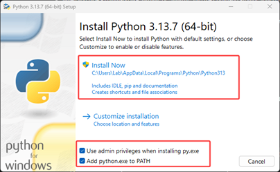

# Python and Jupyter Notebook 安装指南

**前言：** 在实验3和4中，我们将使用 Python 语言和 Jupyter Notebook 工具。这个教程会手把手带你安装 Python 和 Jupyter Notebook。（本指南目前主要针对 Windows 电脑）

## 1. Python 安装

### a. 下载安装包
从 Python 官网下载最新的 Windows 安装包：
[https://www.python.org/downloads/windows/](https://www.python.org/downloads/windows/)


### b. 运行安装程序
双击下载的安装文件。在安装界面上，请务必勾选以下两个选项：

1.  `Use admin privileges when installing py.exe` （为安装程序授予管理员权限）
2.  `Add python.exe to PATH` (**重要：** 将 Python 添加到系统路径。这是什么？请看文末拓展A）

然后点击 `Install Now`。



### c. 禁用路径长度限制
安装成功后，会看到一个提示界面，选择 `Disable path length limit`（禁用路径长度限制。为什么要这么做？请看文末拓展B）。

### d. 验证安装
打开终端（Command Prompt），输入命令 `python --version`。如果安装成功，终端会显示安装的 Python 版本号（例如 `Python 3.13.0`）。

**或者**，输入命令 `python` 会进入 Python 的交互模式（命令行提示符会变成 `>>>`）。输入 `exit()` 并按回车可以退出该模式。


## 2. Jupyter Notebook 安装

### a. 安装 Notebook
打开终端，输入命令 `pip install notebook`。（这个命令什么意思？请看文末拓展C）。

### b. 启动 Notebook
等待下载安装完成。安装完成后在终端输入 `jupyter notebook`。

这个命令会启动 Jupyter Notebook 服务，并自动在你的默认浏览器中打开其界面。此时，浏览器中显示的是你**启动终端时所在的那个目录**的文件列表（图中例子是在C盘用户目录下，但实际路径取决于你在哪里执行的命令）。

你可以在当前目录下创建一个新文件夹来存放实验文件。在文件列表空白处右键即可创建新文件夹，然后双击进入。

**重要：** 运行 Jupyter Notebook 的那个终端窗口必须保持打开状态，它是 Jupyter 的服务器。关闭该终端窗口会同时关闭 Jupyter 服务。


### c. 创建 Notebook
进入文件夹后，点击右上角的 `New` 按钮，选择 `Python 3 (ipykernel)` 来创建一个新的 Jupyter Notebook 文件。（什么是 kernel？请看文末拓展D）


### d. 完成！
好了！你已经成功搭建好了 Jupyter Notebook！运行一个简单程序试试看吧！

```python
print('Hello World!')

x=3
x+=3
print(x)
```


## 3. NumPy 库安装

Python 本身功能强大，但它的更多能力来自于丰富的第三方库（也称为“包”），这些库需要额外安装。在 Lab 3 和 4 中，我们会用到 `numpy` 库。

### a. 安装 NumPy
打开终端（**一个新的终端窗口，或者已经关闭了Jupyter的终端**），输入命令 `pip install numpy`。

### b. 使用 NumPy
等待安装完毕。安装后，**如果 Jupyter Notebook 已经在运行，你需要重启它的内核（Kernel -> Restart）或完全退出 Jupyter 后重新启动**，才能识别新安装的库。

在 Jupyter Notebook 的单元格中，输入 `import numpy` 来引用这个库。NumPy 是 **Numeric Python** 的缩写，它可以帮助我们快速地进行数学运算。

### c. 试试看！
我们来试试吧！在单元格中输入以下代码，然后按 `Shift + Enter` 运行：

```python
import numpy #引用numpy库
x = numpy.array([[1,2,3],[4,5,6],[7,8,9]]) # define a matrix
print(x)

y = x - 1 # minus 1 to all elements in this matrix
print(y)

x_dot_y = numpy.matmul(x, y) # do dot multiplication
print(x_dot_y)
```


## 拓展阅读

### 拓展A：什么是 PATH？为什么要勾选？

PATH 可以理解为电脑的“程序通讯录”或“地址簿”。当我们不将 `python.exe` 加入 PATH 时，电脑就不知道去哪个文件夹找这个程序。当你在终端输入 `python` 时，电脑就会报错“找不到命令”。将它加入 PATH，就相当于把 Python 的地址告诉了电脑，这样你在终端的任何位置都能快速找到并运行它。

### 拓展B：为什么选择 disable path length limit？

老版本的 Windows 系统有一个限制：文件或文件夹的完整路径长度不能超过 260 个字符。在编程时，我们很容易创建出深层嵌套的文件夹（例如一些库的依赖文件），这可能会导致一些意想不到的 `FilePathTooLongException` 错误。选择禁用此限制可以一劳永逸地避免这类问题，是一个安全且推荐的操作。

### 拓展C：`pip install notebook` 命令什么意思？

`pip` 是 Python 的**包管理器** (Package Manager)，你可以把它理解为一个“软件库”或“应用商店”。它的主要任务是从网上（主要是 PyPI，Python Package Index）下载、安装和管理第三方库（Package）。`pip install notebook` 的意思就是：指挥 `pip` 这个工具，去软件库中找到名为 `notebook` 的软件包，并把它下载和安装到你的电脑上。

### 拓展D：什么是 Kernel？

**内核 (Kernel)** 是 Jupyter Notebook 背后真正运行代码的“引擎”或“大脑”。
-   **前端 (Frontend):** 你看到的浏览器界面，负责显示代码和结果，并接收你的输入。
-   **内核 (Kernel):** 负责接收前端的代码，执行计算，并将结果返回给前端显示。

选择不同的内核（如 Python、R、Julia）就意味着用不同的编程语言来解释和执行单元格中的代码。我们选择 `Python 3 (ipykernel)`，就是告诉 Jupyter 使用 Python 来作为执行引擎。