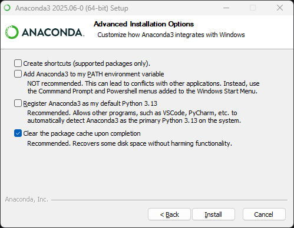
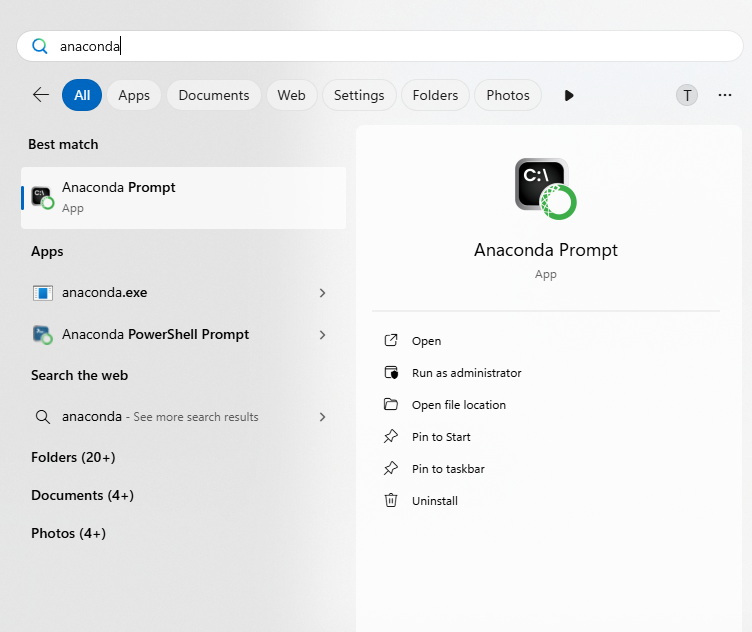
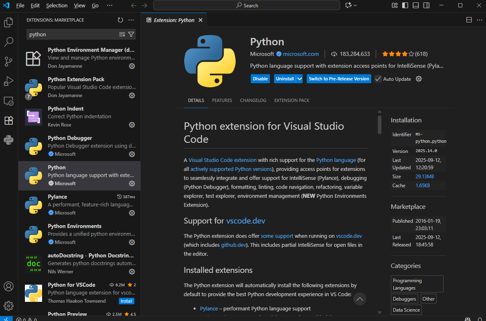
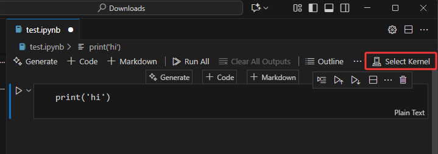
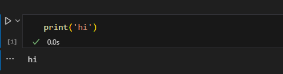

# Anaconda and VSCode Installation Guide

**Introduction**: Welcome to the optional advanced tutorial. This section will introduce two powerful and practical tools: **Anaconda Environment Manager** and **VSCode Integrated Development Environment**. Although their initial setup is a bit more complex, they can greatly improve your development efficiency and management skills. This section is divided into two parts:

-   **Anaconda Part**: Learn how to use the Conda environment manager to create and manage separate project environments.

-   **VSCode Part**: Learn how to run and debug Jupyter Notebooks in the VSCode IDE.

## 1. Anaconda Tutorial

Anaconda is a powerful platform designed for Python and data science. Its core is the **Conda** environment and package management system. Python's strength comes from its many third-party libraries. However, these libraries are maintained by different teams, which can lead to complex version dependency issues. For example, a specific version of PyTorch might require a specific version of NumPy. Installing incompatible libraries in the same environment can easily cause hard-to-debug dependency conflicts and runtime errors.

Anaconda solves this problem with **virtual environments**. You can create a completely separate, independent environment for each project. Each environment has its own Python interpreter, package installation directory, and set of libraries. The environments do not interfere with each other. For example, you can create an environment with Matplotlib and Seaborn for a data visualization project, and another clean environment with only PyTorch for a deep learning project. This method ensures that each project's dependencies are precise and clean, and it fundamentally prevents conflicts between projects.

### a. Install Anaconda

1.  Go to the official Anaconda download page: [https://www.anaconda.com/download/success](https://www.anaconda.com/download/success)
2.  Download and run the installer for your operating system.
3.  During the installation, in the **“Advanced Options”** step, it is **recommended to only check the last option**: `Clear the package cache upon completion`. This can help save disk space.



### b. Create an Environment

1. After Anaconda is installed, open **`Anaconda Prompt`** from the Start Menu. This is a command-line tool configured for Conda.



2. In the `Anaconda Prompt`, type the following command:
```
conda init
```

   This command will **automatically detect** your system settings and complete the initialization. After it's done, **close all currently open terminal windows** (including this Anaconda Prompt).

3. In a new `Anaconda Prompt`, use the following command to create a new environment:

```
conda create --name your_env_name
```

4. Please replace `your_env_name` with any name you like for your environment (for example: `conda create --name arnold`).

5. When prompted `Proceed ([y]/n)?`, type `y` and press Enter to confirm.

6. Congratulations! You have now successfully created a new, isolated environment.

### c. Install Python and Required Libraries in the Environment
First, you must activate your new environment. Otherwise, any packages you install will go into the default (base) environment, which defeats the purpose of using a separate environment.

Use the following command to activate the environment:
```
conda activate your_env_name
```

After activation, notice that the beginning of your command prompt now shows the name of your current environment (in this tutorial's example, it is `(arnold)`).


A newly created environment is initially empty. Next, install a specific version of Python for your project:

```
conda install python
```
You can also install a specific version with a command like `conda install python=3.11` (replace `3.11` with the version you need).

Once Python is installed, you can use `pip install [package_name]` just like before to install all the third-party libraries your project needs in this environment. All these libraries will be isolated within this environment. **Please note:** Even if you have installed Python before, you still need to install it again in the new environment, because a newly created environment is completely empty.

**Please install Jupyter Notebook:**

```
pip install notebook
```


## 2. VSCode Tutorial

Remember Dev C++ from the IP course? Visual Studio Code (VSCode) is a hundred times better. For Python and Jupyter Notebook development, VSCode provides an excellent editing, running, and debugging experience, allowing you to efficiently manage your code, environments, and projects in a single interface.

### a. Install VSCode and Python Extension

1.  **Download and Install VSCode**:
    Visit the [official VSCode website](https://code.visualstudio.com/), download, and install the version for your operating system.

2.  **Install the Python and Jupyter Extensions**:
    -   Launch VSCode.
    -   Click the **Extensions** icon in the Activity Bar on the left to open the Extensions view.
    -   Type `Python` in the search box.
    -   Find the **Python** extension and click the **Install** button.
    -   In the same way, install **Jupyter**.



### b. Use Jupyter Notebook in VSCode
To make VSCode use the Anaconda environment you created, you need to set the correct Python interpreter for it.

1.  Create a new Jupyter Notebook file (with a `.ipynb` extension).
2.  Click `Select Kernel` in the top right corner, then click `Select Python Environment`, and choose the environment we just created. You will see that environments created with Anaconda are labeled as `Conda Env`, while a direct Python installation is labeled as `Global Env`. If you followed the basic tutorial and did not install Anaconda, choose `Global Env`. **Note:** The Kernel is the engine that runs the code. Here, we need to select the environment we just created in Anaconda as the engine.




3. After selecting the Kernel, Jupyter will know you are writing in Python, and syntax highlighting will appear.
   
4. Now you can write code in the code cells (Cell). Place your cursor in a Cell and click the **Run** triangle icon on the left. The results will be displayed directly below the Cell.




