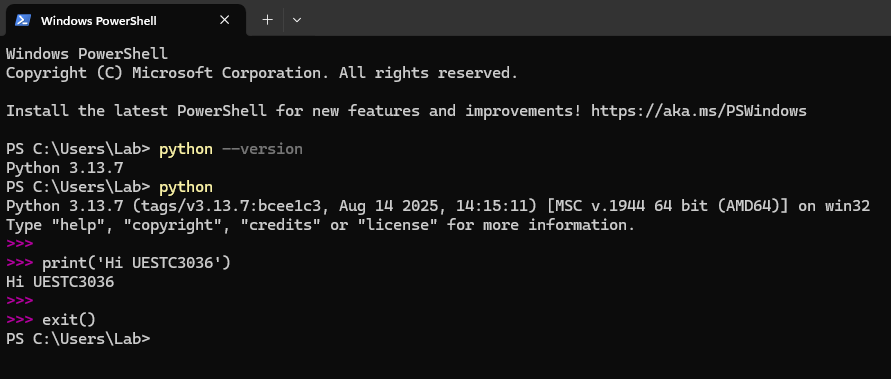

# Python and Jupyter Notebook Installation Guide

**Introduction:** In Labs 3 and 4, we will use the Python language and the Jupyter Notebook tool. This tutorial will guide you step-by-step through installing Python and Jupyter Notebook. (This guide is currently focused on Windows computers).

## 1. Python Installation

### a. Download the Installer
Download the latest Windows installer from the official Python website:
[https://www.python.org/downloads/windows/](https://www.python.org/downloads/windows/)


### b. Run the Installer
Double-click the downloaded installation file. On the installation screen, be sure to check the following two options:

1.  `Use admin privileges when installing py.exe`
2.  `Add python.exe to PATH` (**Important:** Add Python to the system PATH. What is this? See Appendix A at the end.)

Then click `Install Now`.


### c. Disable Path Length Limit
After the installation is successful, you will see a screen with an option to `Disable path length limit`. Click it. (Why do this? See Appendix B at the end).

### d. Verify the Installation
Open a terminal (Command Prompt) and type the command `python --version`. If the installation was successful, the terminal will show the installed Python version number (for example, `Python 3.13.0`).

**Alternatively**, typing the command `python` will enter Python's interactive mode (the command prompt will change to `>>>`). You can type `exit()` and press Enter to leave this mode.



## 2. Jupyter Notebook Installation

### a. Install Notebook
Open a terminal and type the command `pip install notebook`. (What does this command mean? See Appendix C at the end).

### b. Start Notebook
Wait for the download and installation to finish. Once it's done, type `jupyter notebook` in the terminal.

This command starts the Jupyter Notebook service and automatically opens its interface in your default web browser. The file list you see in the browser is from the **directory where you were when you started the terminal** (the example in the image is the user directory on the C drive, but the actual path depends on where you ran the command).

You can create a new folder in the current directory to store your lab files. Right-click in an empty area of the file list to create a new folder, then double-click to enter it.

**Important:** The terminal window where you ran Jupyter Notebook must stay open. It acts as the server for Jupyter. Closing this terminal window will also shut down the Jupyter service.


### c. Create a Notebook
After entering the folder, click the `New` button in the top right corner and select `Python 3 (ipykernel)` to create a new Jupyter Notebook file. (What is a kernel? See Appendix D at the end).


### d. Done!
That's it! You have successfully set up Jupyter Notebook! Try running a simple program to test it.

```python
print('Hello World!')

x=3
x+=3
print(x)
```


## 3. NumPy Library Installation

Python itself is powerful, but much of its strength comes from its many third-party libraries (also called "packages"), which need to be installed separately. In Labs 3 and 4, we will use the `numpy` library.

### a. Install NumPy
Open a terminal (**a new terminal window, or the one you used before if you have already closed Jupyter**), and type the command `pip install numpy`.

### b. Use NumPy
Wait for the installation to finish. After it's installed, **if Jupyter Notebook is already running, you need to restart its kernel (Kernel -> Restart) or completely exit and restart Jupyter** to recognize the newly installed library.

In a Jupyter Notebook cell, type `import numpy` to import the library. NumPy is short for **Numeric Python**, and it helps us perform mathematical calculations quickly.

### c. Try it out!
Let's give it a try! Type the following code into a cell and press `Shift + Enter` to run it:

```python
import numpy # import the numpy library
x = numpy.array([[1,2,3],[4,5,6],[7,8,9]]) # define a matrix
print(x)

y = x - 1 # subtract 1 from all elements in this matrix
print(y)

x_dot_y = numpy.matmul(x, y) # do dot multiplication
print(x_dot_y)
```


### d. Installing Other Required Libraries
In addition to NumPy, Labs 3 and 4 require the following three libraries:
- **pandas**: Used for data processing and analysis
- **matplotlib**: Used for data visualization and plotting
- **sklearn** (scikit-learn): Used for machine learning algorithms

Execute the following commands in the terminal to install these libraries one by one:

```bash
pip install pandas
pip install matplotlib
pip install scikit-learn
```

**Tip:** You can also install all libraries at once by executing:
```bash
pip install pandas matplotlib scikit-learn
```

After installation is complete, remember to **restart the kernel (Kernel -> Restart)** in Jupyter Notebook so that the newly installed libraries can be recognized and used.

## Appendices

### Appendix A: What is PATH? Why check the box?

You can think of the PATH as your computer's "contact list" or "address book" for programs. If we don't add `python.exe` to the PATH, the computer doesn't know which folder to look in to find it. When you type `python` in the terminal, the computer will give a "command not found" error. Adding it to the PATH is like telling the computer Python's address, so you can quickly find and run it from any location in the terminal.

### Appendix B: Why choose to disable the path length limit?

Older versions of Windows have a limit: the full path to a file or folder cannot be longer than 260 characters. When programming, it's easy to create deeply nested folders (for example, for library dependency files), which can cause unexpected `FilePathTooLongException` errors. Disabling this limit is a safe and recommended action that prevents this kind of problem permanently.

### Appendix C: What does the `pip install notebook` command mean?

`pip` is Python's **package manager**. You can think of it as a "software library" or "app store." Its main job is to download, install, and manage third-party libraries (packages) from the internet (mainly from PyPI, the Python Package Index). The command `pip install notebook` means: tell the `pip` tool to find the package named `notebook` in the software library, and then download and install it on your computer.

### Appendix D: What is a Kernel?

The **Kernel** is the "engine" or "brain" that actually runs the code behind the scenes in a Jupyter Notebook.
-   **Frontend:** The browser interface you see, which displays code and results, and receives your input.
-   **Kernel:** It receives the code from the frontend, performs the calculations, and sends the results back to the frontend to be displayed.

Choosing different kernels (like Python, R, or Julia) means you are using different programming languages to interpret and run the code in the cells. When we choose `Python 3 (ipykernel)`, we are telling Jupyter to use Python as its execution engine.
