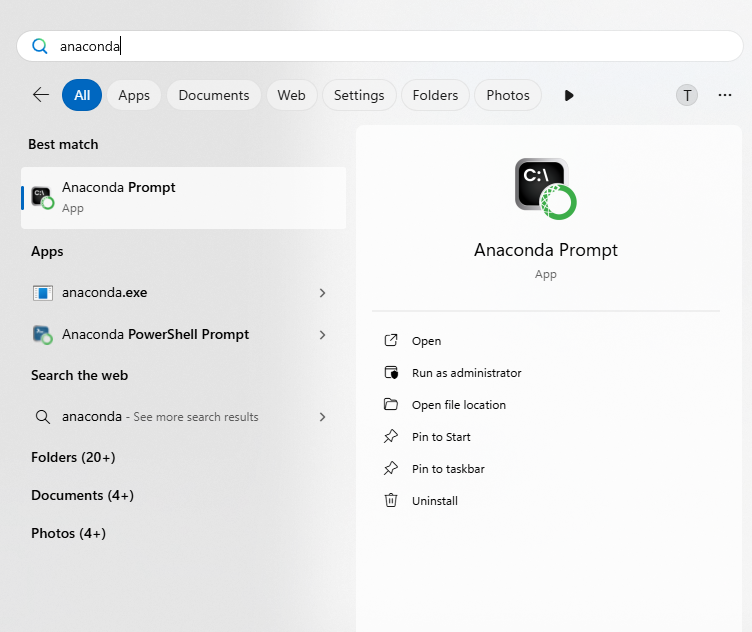
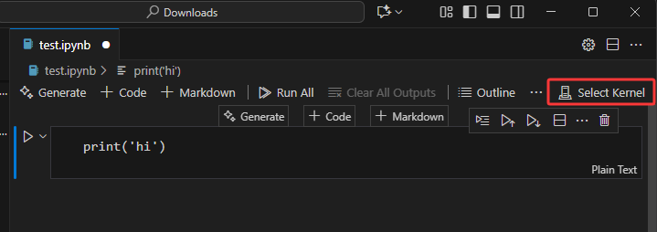

# Anaconda and VSCode 安装指南

**前言**: 欢迎来到可选进阶教程部分。本节将介绍两款功能更强大、也更实用的工具：**Anaconda 环境管理器**和 **VSCode 集成开发环境**。虽然它们的初始设置稍复杂，但能极大地提升你的开发效率和管理能力。本节分为两部分：

-   **Anaconda 部分**：介绍如何使用 Conda 环境管理器来创建和管理独立的项目环境。

-   **VSCode 部分**：介绍如何在 VSCode IDE 中运行和调试 Jupyter Notebook。

## 1. Anaconda Tutorial

Anaconda 是一个专为 Python 和数据科学打造的强大平台，其核心是 **Conda** 环境与包管理系统。Python 的强大离不开丰富的第三方库，但由于这些库由不同的团队独立维护，它们之间的版本依赖往往错综复杂。例如，特定版本的 PyTorch 可能依赖特定版本的 NumPy。若将这些版本不兼容的库安装在同一环境中，极易引发难以调试的依赖冲突和运行时错误。

Anaconda 通过**虚拟环境**解决了这一问题。你可以为每个项目创建一个个完全隔离的独立环境，每个环境都拥有自己独立的 Python 解释器、包安装目录和依赖库集合。环境之间互不干扰。例如，你可以为数据可视化项目创建一个包含 Matplotlib 和 Seaborn 的环境，同时为深度学习项目创建另一个仅安装 PyTorch 的干净环境。这种方式既确保了每个项目依赖项的精确性和纯净性，也从根本上杜绝了项目之间的环境冲突。

### a. 安装 Anaconda

1.  访问 Anaconda 官方下载页面：[https://www.anaconda.com/download/success](https://www.anaconda.com/download/success)
2.  下载并运行适用于你操作系统的安装程序。
3.  在安装过程的 **“Advanced Options”** 步骤中，**建议只勾选最后一项**：`Clear the package cache upon completion`（安装完成后清除包缓存）。这可以帮助节省磁盘空间。


### b. 创建环境

1. Anaconda 安装完成后，通过开始菜单打开 **`Anaconda Prompt`**。这是一个专为 Conda 配置的命令行工具。



2. 在 `Anaconda Prompt` 中，直接输入以下命令：
```
conda init
```

   这个命令会**自动检测**你的系统设置并完成初始化。完成后，**关闭你当前打开的所有终端窗口**（包括这个 Anaconda Prompt）。

3. 在 `Anaconda Prompt` 中，使用以下命令创建新环境：

```
conda create --name your_env_name
```

4. 请将 your_env_name 替换为你喜欢的任意环境名称（例如：conda create --name arnold）。

5. 当提示 Proceed ([y]/n)? 时，输入 y 并按回车确认。

6. 恭喜！至此你已成功创建了一个全新的隔离环境。

### c. 在环境中安装 Python 和所需库
首先，必须激活你的新环境，否则后续安装的包将会被安装到默认的 (base) 环境中，从而失去使用独立环境的意义。

使用以下命令激活环境：
```
conda activate your_env_name
```

激活后，请注意观察命令行提示符的开头，此时应显示你当前所在环境的名称（在本教程示例中为 (arnold)）。


新创建的环境初始为空。接下来，为你的项目安装特定版本的 Python：

```
conda install python
```
你也可以通过 `conda install python=3.11` 这样的命令来安装指定版本（将 3.11 替换为你需要的版本号）。

Python 安装完成后，你就可以像之前一样，使用 `pip install [package_name]` 在该环境中安装项目所需的所有第三方库了。所有这些库都将被隔离在此环境内部。**请注意：**即使同学们之前安装过python，我们仍然需要再次在新的环境中安装，因为新创建环境之后这个环境中是什么都没有的。

**请安装 Jupyter Notebook 和其他所需要的库：**

```
pip install notebook numpy pandas matplotlib scikit-learn
```


## 2. VSCode Tutorial

还记得IP课程用到的Dev C++吗？Visual Studio Code (VSCode) 比他强百倍。对于 Python 和 Jupyter Notebook 开发而言，VSCode 提供了出色的编辑、运行和调试体验，能够在一个统一的界面中高效地管理你的代码、环境和项目。

### a. 安装 VSCode 和 Python 扩展

1.  **下载并安装 VSCode**:
    访问 [VSCode 官方网站](https://code.visualstudio.com/)，下载并安装适用于你操作系统的版本。

2.  **安装 Python 和 Jupyter 扩展**:
    -   启动 VSCode。
    -   点击左侧活动栏中的 **扩展** 图标 打开扩展视图。
    -   在搜索框中输入 `Python`。
    -   找到 **Python** 扩展，点击 **Install** 按钮。
    -   同样方式，安装 **Jupyter**。


### b. 在vscode中使用Jupyter notebook
为了让 VSCode 正确使用你创建的 Anaconda 环境，你需要为其设置正确的 Python 解释器。

1.  创建新的jupyter notebook文件（文件名以.ipynb结尾）。
2.  点击右上角`Select Kernel`，然后点击`Select Python Environment`，选择我们刚创建好的环境。我们可以看到，使用Anaconda创建的环境会被标注为`Conda Env`，而如果不使用Anaconda，而是直接安装python和库的话，会被标注为`Global Env`。如果大家跟着基础教程走，而没有安装Anaconda，则选择`Global Env`。**注：**Kernel 就是运行代码的引擎，这里我们要选择刚刚在 Anaconda 里创建好的那个环境作为引擎。




3. 选择完Kernel之后，Jupyter就知道你在写的是Python语言了，语法高亮就会显示出来了。
   
4. 现在，你就可以在代码单元（Cell）中编写代码了。将光标置于某个 Cell 中，点击左侧的 **运行** 三角图标。运行结果会直接显示在 Cell 下方。


